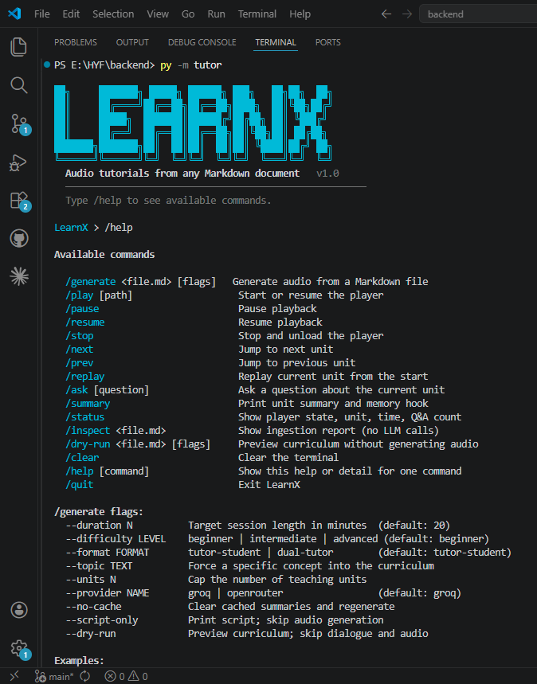

# LearnX CLI


> **Spec-driven development project** — every feature was designed in a written specification before a single line of code was written. See [`specs/`](specs/) for the full day-by-day spec chain.

Turn any Markdown document into an interactive audio tutorial and a fully-produced MP4 video — all from a branded terminal shell.

<p align="center">
  
</p>

---

## What it does

```
.md file → LLM curriculum → TTS audio → interactive player + Q&A
                                       → MP4 video (slides + subtitles)
```

**Audio pipeline (v1):**

1. **Ingests** a Markdown file and chunks it by heading structure or sliding window
2. **Summarises** each chunk with an LLM and plans a teaching curriculum
3. **Generates** a tutor–student (or dual-tutor) dialogue script
4. **Renders** each unit to speech via Microsoft Azure Neural TTS (no TTS API key needed)
5. **Plays back** through an interactive shell with pause, skip, replay, and a live Q&A engine

**Video pipeline (v2):**

6. **Plans** slide visuals — hook question, concept diagram spec, memory hook — per unit via LLM
7. **Renders** diagrams to PNG using Graphviz
8. **Composites** branded slides (1920×1080) using Pillow with a dark theme
9. **Syncs** slides to audio via dialogue beat detection (first ALEX line → hook; first MAYA line → concept; last ALEX line → memory)
10. **Assembles** the final MP4 with ffmpeg — unit videos concatenated, SRT subtitles embedded

---

## How it was built — spec-driven development

### v0 — Engineering foundations

| Spec | Feature |
|---|---|
| [`specs/v0/day0.md`](specs/v0/day0.md) | Project packaging — `pyproject.toml`, entry point, ruff config |
| [`specs/v0/day1.md`](specs/v0/day1.md) | CI — GitHub Actions: lint + format check on every push |
| [`specs/v0/day2.md`](specs/v0/day2.md) | Type safety — mypy strict, all 77 errors resolved (local only) |
| [`specs/v0/day3.md`](specs/v0/day3.md) | Pre-commit hooks + session metadata (`/sessions` with duration + date) |

Each feature day had a written specification reviewed and approved before implementation began:

### v1 — Audio pipeline

| Spec | Feature |
|---|---|
| [`specs/v1/day1.md`](specs/v1/day1.md) | Document ingestion — chunking strategies A/B/C |
| [`specs/v1/day2.md`](specs/v1/day2.md) | LLM summarisation and curriculum planning |
| [`specs/v1/day3.md`](specs/v1/day3.md) | Dialogue generation, difficulty levels, caching |
| [`specs/v1/day4.md`](specs/v1/day4.md) | Interactive audio player — state machine, keyboard controls |
| [`specs/v1/day5.md`](specs/v1/day5.md) | Live Q&A engine — grounded answers, session logging |
| [`specs/v1/day6.md`](specs/v1/day6.md) | Dual-tutor format, `--topic` flag, code quality audit |
| [`specs/v1/day7.md`](specs/v1/day7.md) | Branded `/command` shell — REPL, dynamic prompt, logo |

### v2 — Video pipeline

| Spec | Feature |
|---|---|
| [`specs/v2/day8.md`](specs/v2/day8.md) | Visual spec generation — slide plan via LLM |
| [`specs/v2/day9.md`](specs/v2/day9.md) | Diagram rendering — Graphviz PNG output |
| [`specs/v2/day10.md`](specs/v2/day10.md) | Slide compositor — 1920×1080 Pillow layout |
| [`specs/v2/day11.md`](specs/v2/day11.md) | Subtitle writer + video assembler — SRT + ffmpeg |
| [`specs/v2/day12.md`](specs/v2/day12.md) | Shell integration — `/video`, `/vsessions`, polish |

Post-implementation fixes are documented in [`fixes/`](fixes/) (fix001–fix015).  
Architecture plans: [`plan/v0_plan.md`](plan/v0_plan.md) · [`plan/v1_plan.md`](plan/v1_plan.md) · [`plan/v2_plan.md`](plan/v2_plan.md) · [`plan/v3_plan.md`](plan/v3_plan.md).

### v3 — Conversation-driven slides (planned)

| Spec | Feature |
|---|---|
| [`specs/v3/day13.md`](specs/v3/day13.md) | Exact timing capture — `tutorial.timing.json` from audio builder |
| [`specs/v3/day14.md`](specs/v3/day14.md) | Dialogue-aware visual planner — `SlideSegment` per dialogue block |
| [`specs/v3/day15.md`](specs/v3/day15.md) | Segment slide renderers — 9 visual types, progress dots |
| [`specs/v3/day16.md`](specs/v3/day16.md) | Pipeline integration — exact timing, backward compat |

---

## Quick start

```bash
# 1. Install dependencies
pip install -r requirements.txt

# 2. Add your API key
echo "GROQ_API_KEY=gsk_..." > tutor/.env

# 3. Launch the shell
python -m tutor
```

**Requires:** Python 3.11+, [ffmpeg](https://ffmpeg.org/download.html) in PATH.  
**API key:** Free at [console.groq.com](https://console.groq.com).

---

## Setup

### API keys — `tutor/.env`

```env
GROQ_API_KEY=gsk_...          # required — free at console.groq.com
OPENROUTER_API_KEY=sk-or-...  # optional fallback — free at openrouter.ai
```

### ffmpeg

```bash
winget install ffmpeg          # Windows
brew install ffmpeg            # macOS
apt install ffmpeg             # Linux
```

> LearnX auto-detects common Windows install paths (including versioned folders like
> `C:\ffmpeg\ffmpeg-8.x\bin\`) so a terminal restart is not always required.

### Development

```bash
pip install -e .[dev]
pre-commit install
```

After `pre-commit install`, ruff runs automatically on every commit.

---

## Shell commands

Launch with `python -m tutor`. The prompt updates dynamically to show player state:

```
LearnX > /generate notes.md --difficulty intermediate
LearnX [▶ 2/5  Pass-by-Value] > /ask what is the difference between == and .equals()?
```

### Audio pipeline

| Command | Description |
|---|---|
| `/generate <file.md> [flags]` | Parse notes → generate dialogue → synthesise MP3s |
| `/sessions` | List all audio sessions in `audio/` |
| `/inspect <file.md>` | Show ingestion report — no LLM calls |
| `/dry-run <file.md> [flags]` | Preview curriculum; skip dialogue and audio |

### Audio playback

| Command | Description |
|---|---|
| `/play [session]` | Load and play a session |
| `/pause` | Pause playback |
| `/resume` | Resume from pause |
| `/stop` | Stop and unload the player |
| `/next` | Skip to next unit |
| `/prev` | Go back to previous unit |
| `/replay` | Restart current unit from the beginning |
| `/status` | Show player state, unit, elapsed time, Q&A count |
| `/ask [question]` | Ask a question about the current unit (LLM-powered) |
| `/summary` | Print unit summary and memory hook |

### Video pipeline

| Command | Description |
|---|---|
| `/video [session]` | Render slides + subtitles → assemble `full_session.mp4` |
| `/vsessions` | List sessions that have a completed video |

### Shell

| Command | Description |
|---|---|
| `/help [command]` | List all commands or show detail for one |
| `/clear` | Clear the terminal |
| `/quit` | Exit LearnX |

### `/generate` flags

| Flag | Default | Description |
|---|---|---|
| `--duration N` | `20` | Target session length in minutes |
| `--difficulty LEVEL` | `beginner` | `beginner` / `intermediate` / `advanced` |
| `--format FORMAT` | `tutor-student` | `tutor-student` or `dual-tutor` |
| `--topic TEXT` | — | Force a specific concept into the curriculum |
| `--units N` | auto | Cap the number of teaching units |
| `--provider NAME` | `groq` | `groq` or `openrouter` |
| `--no-cache` | — | Clear cached summaries and regenerate |
| `--script-only` | — | Print dialogue script; skip audio |
| `--dry-run` | — | Preview curriculum; skip dialogue and audio |
| `--verbose` | — | Show INFO-level logs (per-unit progress) |
| `--debug` | — | Write DEBUG logs to `tutor.log` |

---

## Typical workflows

### Audio only

```
/generate week2/3.md
/sessions
/play week2_3
/next
/ask what is the difference between == and .equals()?
/summary
/stop
```

### Audio → Video

```
/generate week2/3.md          # produce audio first
/video week2_3                # render video from existing session
/vsessions                    # confirm output location
```

The video is written to `video/<session>/full_session.mp4`.

### Inspect without generating

```
/inspect notes.md
/dry-run notes.md --difficulty advanced
```

---

## Dialogue formats

**`tutor-student`** (default) — ALEX (tutor) explains; MAYA (student) voices the classic misconception and gets corrected.

**`dual-tutor`** — ALEX lays out the rule; SAM probes edge cases and delivers the memory hook as a peer takeaway.

Voices use [edge-tts](https://github.com/rany2/edge-tts) (Microsoft Azure Neural TTS) — no TTS API key required.

---

## LLM configuration — `tutor/llm_config.toml`

All model names, token budgets, and call settings live in one file. No Python edits needed to switch models or tune limits:

```toml
[providers.groq]
curriculum = "llama-3.3-70b-versatile"
dialogue   = "llama-3.1-8b-instant"

[max_tokens]
dialogue = 1500

[limits]
max_source_tokens = 1500   # raise on paid tier

[llm]
temperature   = 0.7
retry_count   = 2
```

| Provider | Models | Notes |
|---|---|---|
| `groq` (default) | `llama-3.3-70b` (curriculum), `llama-3.1-8b` (dialogue, Q&A) | Free tier, fast |
| `openrouter` | `gemma-3-27b`, `llama-3.1-8b` (free tier) | Fallback option |

---

## Ingestion strategies

Auto-selected based on document size:

| Strategy | Condition | Behaviour |
|---|---|---|
| A | ≤ 6 k tokens | Whole document as one chunk |
| B | 6 k – 60 k tokens | Split on `##` headings |
| C | > 60 k tokens or no headings | Sliding window (2 k tokens, 200-token overlap) |

Run `/inspect <file.md>` to see which strategy was chosen.

---

## Q&A engine

Press `/ask` at any point during playback:

1. Audio pauses automatically
2. Type your question at the prompt
3. The LLM answers in 1–3 seconds, grounded in the source document and prior exchanges
4. Every exchange is saved to `tutorial.session.json`

---

## Output files

### Audio session — `audio/<session>/`

| File | Contents |
|---|---|
| `tutorial.mp3` | Full concatenated audio |
| `tutorial_units/` | Per-unit `.mp3` files for the player |
| `tutorial.script.txt` | Full dialogue script |
| `tutorial.units.json` | Teaching unit metadata (lines, concepts, key points) |
| `tutorial.chunks.json` | Source chunks used for Q&A context |
| `tutorial.meta.json` | Source file path (used by video pipeline for title) |
| `tutorial.session.json` | Q&A exchanges from the current session |

### Video session — `video/<session>/`

| File | Contents |
|---|---|
| `full_session.mp4` | Final assembled video with subtitles |
| `slides/` | Composited slide PNGs (title, hook, concept, memory, outro per unit) |
| `subtitles.srt` | SRT subtitle file |
| `tutorial.visuals.json` | Cached visual spec (slide plan from LLM) |

---

## Tests

```bash
python -m pytest
```

220 tests across ingestion, generation, audio, player, visual, and CLI modules. No API keys required — all LLM calls are mocked.

---

## Project structure

```
tutor/
  cli/                  # Interactive shell
    shell.py            # REPL loop + dynamic prompt
    commands.py         # /command handlers (audio pipeline)
    video_commands.py   # /video and /vsessions handlers
    logo.py             # ASCII banner
    theme.py            # ANSI colour helpers
  player/               # Audio player
    player.py           # TutorPlayer state machine
    player_display.py   # Status bar and Q&A display
    input_handler.py    # Cross-platform keyboard input
  generation/           # LLM pipeline
    curriculum.py       # Teaching unit planning
    dialogue.py         # Script generation + caching
    assembler.py        # Intro/outro + line assembly
    visual_planner.py   # Slide plan generation (v2)
  ingestion/            # Document parsing
    chunker.py          # Strategy A/B/C chunking
    summarizer.py       # Per-chunk LLM summarisation
    doc_analyzer.py     # Strategy selection + profile
    parse_content.py    # Markdown content extraction
  qa/                   # Q&A engine
    qa.py
  audio/                # TTS rendering
    audio_builder.py
    tts_renderer.py
    sanitizer.py        # Code-to-speech substitutions
  visual/               # Video pipeline (v2)
    __init__.py         # run_visual_pipeline() entry point
    slide_compositor.py # Pillow slide layout (1920×1080)
    slide_theme.py      # Colours, fonts, constants
    slide_draw.py       # Drawing primitives
    diagram_renderer.py # Graphviz PNG rendering
    beat_timer.py       # Slide timing from dialogue beats
    subtitle_writer.py  # SRT generation
    video_assembler.py  # ffmpeg pipeline
  infra/
    llm.py              # LLM client + config loader
  assets/               # Fonts and logo resources
  config.py             # ffmpeg detection and env validation
  constants.py          # Tuning knobs (WPM, voices, limits)
  exceptions.py         # TutorError hierarchy
  inspector.py          # /inspect report printer
  models.py             # Dataclasses (Chunk, TeachingUnit, VisualSpec …)
  llm_config.toml       # Model names, token budgets, call settings
  prompts/              # Prompt templates (curriculum, dialogue, qa, visual)
  tests/                # 220 tests — no API keys required
specs/
  v0/                   # Engineering foundations specs (Days 0–3)
  v1/                   # Audio pipeline specs (Days 1–7)
  v2/                   # Video pipeline specs (Days 8–12)
  v3/                   # Conversation-driven slides specs (Days 13–16, planned)
plan/                   # Architecture planning documents (v0–v3)
fixes/                  # Post-implementation fix notes (fix001–fix015)
audio/                  # Generated audio sessions (gitignored)
video/                  # Generated video sessions (gitignored)
```
