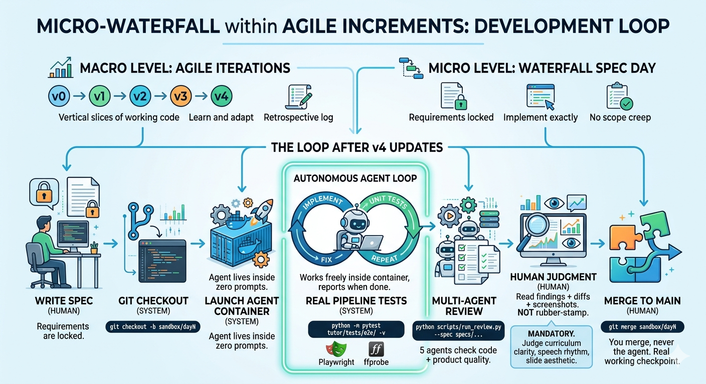

# LearnX


[](https://pypi.org/project/learnx-cli/)

Turn any Markdown document into an audio tutorial and MP4 video from a terminal shell.

<p align="center">
  <a href="https://youtu.be/q2ugLYZxHSI">
    
  </a>
  <br/>
  <em>Example output: <a href="https://youtu.be/q2ugLYZxHSI">Java Concepts tutorial</a> generated from <code>learning/javaConcept.md</code></em>
</p>

```
.md file → LLM curriculum → TTS audio → interactive player + Q&A
                           → LLM segment plan → HTML slides → MP4 video
```

<p align="center">
  
</p>

---

## Quick start

```powershell
pip install -r requirements.txt
echo "GROQ_API_KEY=gsk_..." > tutor/.env
playwright install chromium
python -m tutor
```

Requires Python 3.12+, [ffmpeg](https://ffmpeg.org/download.html) in PATH.
Free API key at [console.groq.com](https://console.groq.com).

```
LearnX > /generate notes.md    # markdown → dialogue → audio
LearnX > /play                  # interactive player with live Q&A
LearnX > /video                 # render slides + assemble MP4
LearnX > /help                  # all commands
```

---

## How it was built

Two layers share this repository:

- **LearnX CLI** (`tutor/`) — the product. Audio tutorial generator.
- **DevLoop** (`scripts/`) — the build system. Runs Claude in Docker, manages the spec-driven development loop, orchestrates a 5-agent review pipeline.

Spec-driven development — every feature started as a written specification before any
code was written. 31 spec days across v0–v11. Full spec chain in [`specs/`](specs/).
Full workflow documentation in [`DEVLOOP.md`](DEVLOOP.md).

<p align="center">
  
</p>

---

## Dev workflow

Each spec day follows this loop:

```
write spec → create branch → devloop launch → review report → merge
```

Claude implements the spec inside a Docker container. When it exits, E2E tests and a
two-phase 5-agent review run automatically. Phase 1 discovers issues and applies fixes;
Phase 2 verifies resolution.

---

## One-time setup

Do this once on a new machine.

**1. Install Docker Desktop**

Download from [docker.com/products/docker-desktop](https://www.docker.com/products/docker-desktop/).
Open Docker Desktop and wait for the status bar to show **"Engine running"**.

**2. Build the Docker image** (from the project root)

```powershell
docker build -t learnx-dev .
```

Takes 2–5 minutes. Only re-run when `requirements.txt` changes.

**3. Activate the Python venv**

```powershell
.\.venv\Scripts\Activate.ps1
```

> If blocked by execution policy:
> `Set-ExecutionPolicy -ExecutionPolicy RemoteSigned -Scope CurrentUser`

---

## Running a spec day

### Step 1 — Open Docker Desktop

Make sure the status bar shows **"Engine running"** before continuing.

### Step 2 — Open a PowerShell window

> Must be a real PowerShell window — not inside a Claude Code session.

```powershell
cd C:\Users\yusup\LearnX-CLI
.\.venv\Scripts\Activate.ps1
```

### Step 3 — Create the branch

```powershell
git checkout main
git checkout -b sandbox/dayN
```

Replace `dayN` with the actual day number (e.g. `day32`).

### Step 4 — Dry run

```powershell
python scripts/devloop.py --spec specs/v11/dayN.md --review --dry-run
```

Prints the commands that will run without executing anything. Check it looks right.

### Step 5 — Launch

```powershell
python scripts/devloop.py --spec specs/v11/dayN.md --review
```

Claude Code opens inside the container. When you see the `>` prompt, paste the
handoff from [`dev_setup/handoff_template.md`](dev_setup/handoff_template.md).

Then walk away.

### Step 6 — What happens automatically

After Claude finishes and exits the container:

1. **E2E smoke tests** run inside the container (ffmpeg + Playwright available)
2. **Phase 1 review** — 3 agents discover issues and apply fixes
3. **Phase 2 review** — 2 agents verify the fixes and check for regressions
4. A consolidated report prints with `MERGE READY` or `NEEDS FIXES`

### Step 7 — After the report

If `MERGE READY`:

```powershell
git checkout main
git pull origin main
gh pr create --title "dayN: ..." --body "..."
```

If `NEEDS FIXES`: read the findings, fix the issues, re-run the merge gate:

```powershell
python -m pytest tutor/tests/ --ignore=tutor/tests/e2e/ -v
python -m ruff check tutor/
```

---

## Launcher modes

Docker is the default. Always.

| Command | Effect |
|---|---|
| `python scripts/devloop.py --spec X` | Docker — implement spec X, no review |
| `python scripts/devloop.py --spec X --review` | Docker — implement X, then E2E + two-phase review |
| `python scripts/devloop.py --version vN --review` | Docker — run all specs in vN sequentially with review |
| `python scripts/devloop.py --version vN --serve` | Same, with live dashboard at localhost:8080 |
| `python scripts/devloop.py --explore` | Host only — read-only, no code changes |
| `python scripts/devloop.py --dry-run` | Print commands without executing |

**`--version`** runs every spec in `specs/vN/` in day-number order. Each spec gets
its own sandbox branch (`sandbox/vN-dayN`). Rate-limit retries and session/idle
timeouts are handled automatically.

**`--serve`** (with `--version`) starts a dashboard at `http://localhost:8080` showing
live container output and per-spec status as the run progresses. Port is configurable
via `--port N` or `LEARNX_DASHBOARD_PORT` env var or `devloop.toml`.

**`--explore`** starts Claude on the host with read-only permissions (Read, Grep, Glob,
git read commands). Use it to ask questions about the codebase without risking
accidental edits.

> Always use forward slashes in `--spec`: `specs/v11/day1.md` not `specs\v11\day1.md`.
> Backslashes corrupt the path (`\v` is a vertical-tab character).

---

## Which model?

Change model inside any Claude session with `/model`:

| Model | Speed | Best for |
|-------|-------|----------|
| `claude-sonnet-4-6` | fast | default — most tasks |
| `claude-opus-4-7` | slower, smarter | complex reasoning, hard bugs |
| `claude-haiku-4-5` | fastest | simple tasks, quick lookups |
