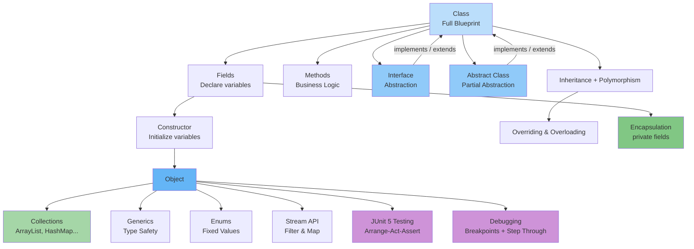

### **My Understanding of Java OOP Concepts** (Complete Version)

I see that a **Class** is full with **fields**, **constructors**, and **methods**.  

**Interface** has no constructor, which means **Interface is a minimal version of Class**. We add Interface to a Class using the `implements` keyword.  

**Object** is created using **Constructor**.  

**Field** is for **declaring** variables.  

**Constructor** is for **initializing** the variables. Constructor doesn’t have a return type.  

**Methods** are actions or business logic. They can only be used after the object is created, and they have a return type.  

**Inheritance** is used to inherit from another class. In the constructor, we use `super()` to call the superclass constructor.  

**Polymorphism** means many forms of objects.  

**Method Overriding** is when we override superclass methods with new implementation.  

**Method Overloading** is writing multiple methods with the same name but different parameters.  

**Encapsulation** is privatization of fields (making fields `private` and using getters/setters).  

**Abstraction** is what Interface is doing (hiding complexity and showing only the contract).

---

### **Additional Concepts I Learned**

- **Abstract Class** is a class that cannot be instantiated (we cannot create its object). It can have both abstract methods (without body) and normal methods (with body). It is used when we want partial abstraction.

- **`static`** keyword means something belongs to the **class** instead of the object. Static methods and variables can be used without creating an object.

- **`final`** keyword means something **cannot be changed** later.

- **`this`** refers to the **current object**.  
- **`super`** refers to the **parent class**.

- **Packages** are like folders that organize classes.  
- **Imports** are used to bring classes from other packages.

---

### **My Understanding of Week 3 Concepts (Data Handling)**

- **Java Collections**: Instead of fixed-size arrays, we use **ArrayList**, **HashSet**, and **HashMap**. These are flexible and resizable data structures.

- **Generics**: Generics allow me to write classes and methods that work with different types while keeping full type safety, without manual casting. Example: `List<Book>`.

- **Enums**: Enums are used to represent fixed values (like statuses). They are better than magic strings or numbers. Example: `BookStatus.AVAILABLE`.

- **Stream API**: Stream API helps me filter, map, transform, and collect data in a modern and readable way instead of writing traditional loops.

---

### **My Understanding of Testing & Debugging**

- **JUnit Testing (Unit Testing)**: JUnit 5 is used to test our code properly. We write test cases for our methods to check if they work correctly. We follow the **Arrange-Act-Assert** pattern:
  - **Arrange**: Prepare the data and objects
  - **Act**: Call the method we want to test
  - **Assert**: Check if the result is what we expected

- **Debugging in IntelliJ IDEA**: Debugging is the process of finding and fixing bugs in the code. In IntelliJ, I can set **breakpoints**, run the program in debug mode, step through the code line by line, and inspect the values of variables at runtime to understand what is happening inside the program.

---

### **Updated Visual Graph**

---

This is now a **complete summary** of everything from Weeks 1 to 3 in **Yusup's own style**.

