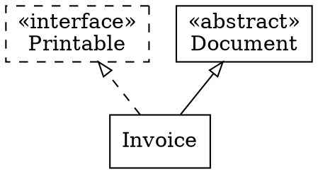
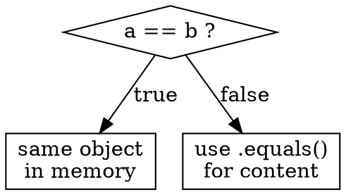

# LearnX v2 — Visual Learning Plan

## The problem with audio alone

Audio is linear and invisible. You can't glance back at what was said, you can't see
the structure of a concept, and your working memory has to hold everything at once.
Research on multimedia learning (Mayer, 2001) is consistent: audio paired with a
relevant still image outperforms audio alone for retention. Flowcharts and diagrams
in particular help learners build the correct mental model — they externalise the
structure that the listener is trying to construct internally.

The goal of v2 is not decoration. Every visual element must carry information that
the audio does not already carry clearly on its own.

---

## What you described — and what's missing

**What you said:**
> "I want a presentation that changes alongside the conversation, ideally with flowcharts,
> so I can see the concept visually while I listen. Turn it into a video."

**That's achievable. Here's what your idea doesn't yet specify:**

| Gap | Why it matters | Decision made in this plan |
|---|---|---|
| What goes on a slide? | "Presentation" could mean 50 things | Defined below: 5-element template |
| When does the slide change? | Slides that don't sync with audio are useless | Estimated from word count; per beat, not per line |
| What diagram type? | Not every concept is a flowchart | LLM chooses from 4 types; falls back to bullet layout |
| How are diagrams rendered? | Code → image requires a render step | graphviz (free) for graphs; Pillow for text layouts |
| How does audio → video? | Need a compositor | ffmpeg (already installed); no moviepy needed |
| Does video replace the player? | Affects the whole UX | No — video is a generated output alongside audio; player stays |
| Does Q&A still work? | Video is passive; player is interactive | Video has subtitles; Q&A stays in the player |

---

## Architecture

```
                         ┌─────────────────────────────────┐
  .md file               │  EXISTING (v1)                  │
     │                   │                                 │
     ▼                   │  ingestion → summarise →        │
  chunker ──────────────►│  curriculum → dialogue → TTS   │
                         │       │                         │
                         │       ▼                         │
                         │  tutorial_units/*.mp3           │
                         │  tutorial.units.json  ◄─────────┼──── already has:
                         │  tutorial.script.txt  ◄─────────┼──── concept, key_facts,
                         └─────────┬───────────────────────┘     analogy, memory_hook
                                   │
                         ┌─────────▼───────────────────────┐
                         │  NEW (v2)                       │
                         │                                 │
                         │  1. visual_planner.py           │
                         │     LLM generates visual spec   │
                         │     → tutorial.visuals.json     │
                         │                                 │
                         │  2. diagram_renderer.py         │
                         │     graphviz / Pillow           │
                         │     → slides/*.png              │
                         │                                 │
                         │  3. subtitle_writer.py          │
                         │     dialogue script → .srt      │
                         │                                 │
                         │  4. video_assembler.py          │
                         │     ffmpeg: png + mp3 → .mp4   │
                         │     embeds subtitle track       │
                         │                                 │
                         │  Output: audio/<session>/       │
                         │    unit_01.mp4                  │
                         │    unit_02.mp4  ...             │
                         │    full_session.mp4             │
                         └─────────────────────────────────┘
```

---

## Free packages used

| Package | Purpose | Install |
|---|---|---|
| `graphviz` | Render DOT → PNG for class/flow diagrams | `pip install graphviz` + `winget install graphviz` |
| `Pillow` | Compose slide images (background, text, layout) | `pip install Pillow` |
| `ffmpeg` | Combine PNGs + MP3 → MP4, embed subtitles | already installed |

No paid APIs. No browser required. No moviepy. Everything runs locally.

---

## Slide structure — the 5-element template

Every slide for every unit follows the same layout. Consistency helps the viewer
know where to look without re-learning the layout each time.

```
┌──────────────────────────────────────────────────────────────┐
│  UNIT 2 / 5                           [LearnX logo — small]  │
│                                                              │
│  Interface vs Abstract Class                                 │  ← concept title
│  ─────────────────────────────────────────────────────────   │
│                                                              │
│  • Interface: contract only — no state, no constructor       │  ← 3–5 key points
│  • Abstract class: partial implementation, can hold state    │    (bullet layout)
│  • Java allows multiple interface implementation             │
│                                                              │
│  ┌──────────────────────────────┐                           │
│  │  [DIAGRAM]                   │                           │  ← diagram (right or
│  │  class hierarchy / flowchart │                           │    below if large)
│  │  or code block               │                           │
│  └──────────────────────────────┘                           │
│                                                              │
│  Memory hook: "Interfaces are contracts,                     │  ← memory hook
│               abstract classes are blueprints."              │    (bottom, italic)
└──────────────────────────────────────────────────────────────┘
```

Each unit gets **3 slides** that advance with the audio beat:

| Slide | When it appears | What it shows |
|---|---|---|
| **Hook slide** | Start of unit | Title + the opening question ALEX asks |
| **Concept slide** | After hook, when ALEX explains | Title + key points + diagram |
| **Memory hook slide** | End of unit, at the memory_hook line | Full memory hook + summary bullets |

This means 3 slides × N units + 1 title card + 1 outro card.

---

## Diagram types

The LLM chooses one diagram type per unit based on the concept. Four types are supported:

### 1. `class_diagram` — for OOP and type relationships
Generated as graphviz DOT, rendered to PNG.
Used for: inheritance, interfaces, abstract classes, generics.



### 2. `flowchart` — for logic, control flow, decision trees
Used for: if/else logic, loop behaviour, exception handling, lifecycle methods.



### 3. `code_comparison` — for before/after or wrong/right patterns
Rendered by Pillow as a two-column slide with syntax-highlighted text blocks.
Used for: common misconceptions, correct vs incorrect code, type casting.

```
WRONG                    CORRECT
─────────────────────    ─────────────────────
String a = "hello";      String a = "hello";
String b = "hello";      String b = "hello";
if (a == b) { ... }      if (a.equals(b)) { ... }
// compares references   // compares content
```

### 4. `concept_map` — for relationships between multiple ideas
A small graph of labelled nodes and edges, generated with graphviz.
Used for: collections framework, design patterns, dependency relationships.

**Fallback:** If the LLM cannot determine a useful diagram, the diagram slot is filled
with the `good_analogy` text rendered as a styled quote block.

---

## Visual spec generation — new LLM call

A new call_type `"visual"` is added to `llm_config.toml`. The visual planner sends
the already-computed unit metadata (concept, key_facts, analogy, memory_hook,
common_misconception) plus the dialogue script lines to the LLM and asks for a
JSON visual spec.

**Input to LLM:**
```json
{
  "concept": "Interface vs Abstract Class",
  "key_facts": ["interfaces have no state", "abstract classes can"],
  "common_misconception": "they are interchangeable",
  "good_analogy": "interface = contract, abstract = blueprint",
  "memory_hook": "Can-do vs Is-a",
  "dialogue_excerpt": "ALEX: What's the difference between ..."
}
```

**Output from LLM:**
```json
{
  "slide_title": "Interface vs Abstract Class",
  "hook_question": "If both can have abstract methods, why do we need both?",
  "key_points": [
    "Interface: contract only, no state, no constructor",
    "Abstract class: partial implementation, can hold fields",
    "Multiple interfaces allowed; only one abstract class"
  ],
  "diagram_type": "class_diagram",
  "diagram_spec": "digraph { ... }",
  "memory_hook_display": "Interfaces = Can-do contract. Abstract = Is-a blueprint."
}
```

The visual spec is saved alongside other outputs:
```
audio/week2_3/
  tutorial.visuals.json    ← new
  slides/
    unit_00_hook.png
    unit_01_concept.png
    unit_01_memory.png
    ...
```

---

## Timing — how slides sync to audio

The audio is pre-rendered MP3 so we do not have word-level timestamps. Instead,
timing is estimated from the dialogue script (which we already have):

```python
def estimate_beat_offsets(dialogue_lines, wpm=130):
    """Return seconds offset for each named beat in the dialogue."""
    offset = 0.0
    for line in dialogue_lines:
        words = len(line.text.split())
        duration = (words / wpm) * 60
        duration += SILENCE_TURN_MS / 1000   # inter-turn gap
        yield offset, line
        offset += duration
```

Slide 1 (hook) → offset of the first ALEX line  
Slide 2 (concept) → offset of ALEX's explanation line (after MAYA's first turn)  
Slide 3 (memory hook) → offset of the memory_hook line (last ALEX line per unit)

This estimation is accurate to ±2–3 seconds — good enough for educational content
where the learner's eye has time to read the slide.

---

## Video assembly — ffmpeg only

No moviepy. ffmpeg handles everything via its concat demuxer:

```python
# 1. Build a concat script describing slide durations
concat_lines = [
    "ffconcat version 1.0",
    f"file 'slides/unit_01_hook.png'",
    f"duration 8.3",
    f"file 'slides/unit_01_concept.png'",
    f"duration 42.1",
    ...
]
Path("slides/concat.txt").write_text("\n".join(concat_lines))

# 2. Combine slides + audio
subprocess.run([
    "ffmpeg", "-f", "concat", "-safe", "0",
    "-i", "slides/concat.txt",
    "-i", "unit_01.mp3",
    "-c:v", "libx264", "-c:a", "aac",
    "-pix_fmt", "yuv420p",
    "-shortest",
    "unit_01.mp4"
])
```

For the full session video, the per-unit MP4s are concatenated:
```
ffmpeg -f concat -safe 0 -i unit_list.txt -c copy full_session.mp4
```

Subtitles are generated as an SRT file from the dialogue script and embedded:
```
ffmpeg -i full_session.mp4 -i subtitles.srt -c copy -c:s mov_text full_session_sub.mp4
```

---

## New shell commands

```
/video [session-name]     Generate video for a session (must run /generate first)
/video week2_3            Generates audio/week2_3/full_session.mp4
```

`/generate` will gain a `--video` flag that runs the full pipeline in one go:
```
/generate week2/3.md --video
```

`/sessions` will show a `[video]` tag next to sessions that have an MP4.

---

## Implementation days

### Day 8 — Visual spec generation
- Add `"visual"` call_type to `llm_config.toml`
- `tutor/generation/visual_planner.py` — prompt, LLM call, JSON parse, cache
- `tutorial.visuals.json` written alongside other outputs
- Tests: mock LLM, verify JSON schema, test 4 diagram type paths

### Day 9 — Diagram rendering
- `tutor/visual/diagram_renderer.py`
  - `render_class_diagram(spec)` → PNG via graphviz
  - `render_flowchart(spec)` → PNG via graphviz
  - `render_code_comparison(wrong, right)` → PNG via Pillow
  - `render_concept_map(spec)` → PNG via graphviz
  - `render_analogy_fallback(text)` → PNG via Pillow
- Tests: render one of each type, assert file exists and is valid PNG

### Day 10 — Slide compositor
- `tutor/visual/slide_compositor.py`
  - `compose_hook_slide(unit, visual_spec)` → PNG
  - `compose_concept_slide(unit, visual_spec, diagram_png)` → PNG
  - `compose_memory_slide(unit, visual_spec)` → PNG
  - `compose_title_card(doc_title)` + `compose_outro_card(stats)` → PNG
- Consistent palette: dark background (#1a1a2e), cyan accent (#00b4d8), white text
- Tests: compose all slide types, check pixel dimensions (1920×1080)

### Day 11 — Subtitle writer + video assembler
- `tutor/visual/subtitle_writer.py`
  - `build_srt(dialogue_lines, unit_start_offset)` → SRT string
  - Timing estimated from word count
- `tutor/visual/video_assembler.py`
  - `build_unit_video(unit_idx, mp3, slide_pngs, timings)` → MP4
  - `build_session_video(unit_mp4s)` → full_session.mp4
  - `embed_subtitles(mp4, srt)` → final MP4
- Tests: mock ffmpeg, verify concat script content and subprocess calls

### Day 12 — Shell integration + polish
- `/video` command in `commands.py`
- `--video` flag in `_make_generate_parser()`
- `cmd_generate` flow: if `--video`, call video pipeline after audio
- `/sessions` shows `[mp4]` badge if `full_session.mp4` exists
- Progress output during video generation
- Update README

---

## What this does NOT do

- **No real-time animation** — slides are stills; transitions are cuts (ffmpeg can do
  fades but this is deferred to v3)
- **No speaker labels in video** — subtitles show the text; the audio voices already
  differentiate speakers clearly
- **No interactive video** — the MP4 is passive; Q&A stays in the `/play` shell session
- **No AI image generation** — diagrams are data-driven renders, not DALL-E images
- **No browser** — all rendering is done in-process with Pillow and graphviz

---

## Risk log

| Risk | Likelihood | Mitigation |
|---|---|---|
| LLM generates invalid DOT syntax | Medium | graphviz error caught → fallback to analogy block |
| Slide/audio drift > 5 seconds | Low-Medium | Acceptable for v2; v3 can add Whisper timestamps |
| graphviz not in PATH | Low | Same detection pattern as ffmpeg in `_check_ffmpeg()` |
| Pillow font rendering on Windows | Low | Bundle a monospace TTF in `tutor/assets/` |
| `libx264` not available in ffmpeg build | Low | User has essentials build which includes x264 |

---

## File layout after v2

```
tutor/
  generation/
    visual_planner.py     ← new Day 8
  visual/                 ← new package Day 9–11
    __init__.py
    diagram_renderer.py
    slide_compositor.py
    subtitle_writer.py
    video_assembler.py
  assets/
    font_mono.ttf         ← bundled font for Pillow
    logo_small.png        ← LearnX logo for slide corner

audio/
  week2_3/
    tutorial.mp3
    tutorial_units/
    tutorial.visuals.json   ← new
    slides/                 ← new
      title_card.png
      unit_01_hook.png
      unit_01_concept.png
      unit_01_memory.png
      ...
    unit_01.mp4             ← new
    unit_02.mp4             ← new
    full_session.mp4        ← new
    subtitles.srt           ← new
```
